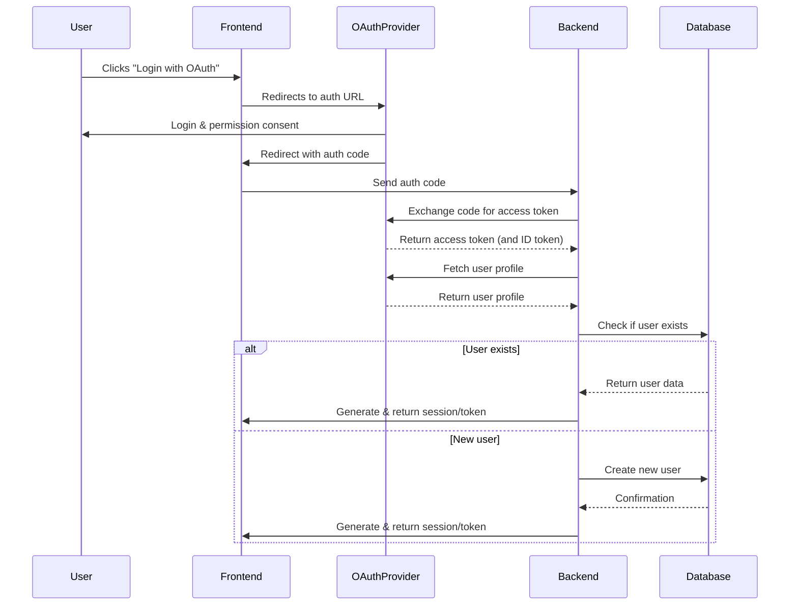

# Description
This is a Mermaid sequence diagram that outlines a typical OAuth login flow (e.g. “Log in with Google” or “Log in with Facebook”) from a backend perspective showing the interactions between the User, Frontend, Backend, OAuth Provider, and Database.

